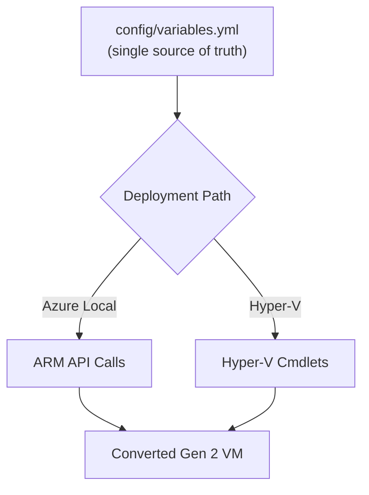

# Automation Interoperability

> **Canonical reference:** [Scripting Framework (full)](https://azurelocal.cloud/standards/scripting/scripting-framework)  
> **Applies to:** All AzureLocal repositories  
> **Last Updated:** 2026-03-17

---

## Overview

This standard defines how automation tools interoperate within the VM Conversion Toolkit. Scripts support both Azure Local and Hyper-V paths using a shared configuration source.

---

## Config Flow

---

## Tool Integration

| Tool | Azure Local Path | Hyper-V Path |
|------|:---:|:---:|
| **PowerShell (Az module)** | ✅ | — |
| **PowerShell (Hyper-V module)** | — | ✅ |
| **Azure CLI** | ✅ | — |

---

## Interoperability Rules

1. **Single source of truth** — `config/variables.yml` is the only config file. Both runbook paths read from it.
2. **Shared schema** — Azure Local and Hyper-V paths share the same variable schema but differ in which variables are required.
3. **Idempotency** — All scripts must detect existing Gen 2 VMs and skip.
4. **Safety** — Always checkpoint before conversion; never modify running VMs.
5. **Logging** — All operations logged with consistent format.

---

## Variable Path Contract

Scripts must use variable paths that exist in the schema. See the [Variable Standards](variables.md) for naming rules and the [Variable Reference](../reference/variables.md) for the complete catalog.

---

## Related Standards

- [Scripting Standards](scripting.md)
- [Infrastructure Standards](infrastructure.md)
- [Solution Standards](solutions.md)
- [Variable Standards](variables.md)
